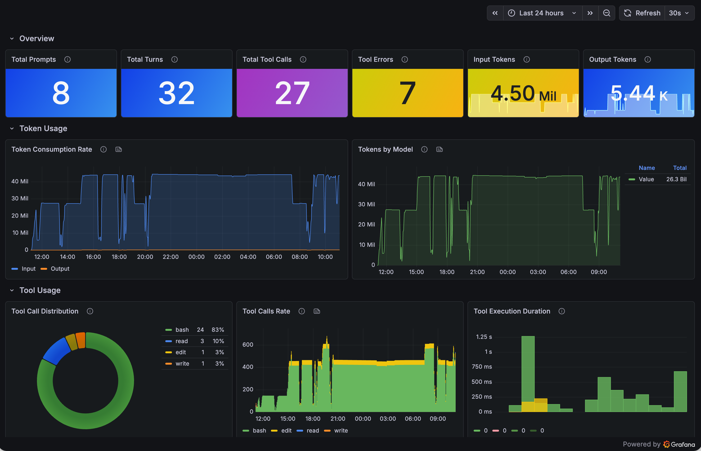

# Pi OTEL Telemetry Extension

OpenTelemetry tracing and metrics for [pi coding agent](https://github.com/badlogic/pi-mono). Exports spans and counters for sessions, agent prompts, LLM turns, and tool executions.

## Trace Structure

```
session                          (root span, entire session lifecycle)
├── agent.prompt                 (one per user message)
│   └── agent.turn               (one per LLM call + tool execution cycle)
│       ├── llm.request          (span event: before provider API call)
│       ├── tool.bash            (tool execution span)
│       ├── tool.read            (tool execution span)
│       └── tool.edit            (tool execution span)
├── model.changed                (span event on model switch)
└── session.compacted            (span event on compaction)
```

## Metrics

| Metric | Type | Labels | Description |
|--------|------|--------|-------------|
| `pi.tokens.input` | Counter | — | Total input tokens consumed |
| `pi.tokens.output` | Counter | — | Total output tokens produced |
| `pi.tool.calls` | Counter | `tool.name` | Total tool invocations |
| `pi.tool.errors` | Counter | `tool.name` | Total failed tool invocations |
| `pi.tool.duration` | Histogram (ms) | `tool.name` | Tool execution time |
| `pi.turns` | Counter | — | Total LLM turns |
| `pi.prompts` | Counter | — | Total user prompts |
| `pi.session.duration` | Histogram (s) | — | Session duration |

## Account Identity

The extension automatically resolves user identity at startup and attaches it to all traces and metrics as OTEL resource attributes:

| Resource Attribute | Source | Description |
|-------------------|--------|-------------|
| `user.email` | `PI_OTEL_USER_EMAIL` or `git config user.email` | User email |
| `user.full_name` | `PI_OTEL_USER_NAME` or `git config user.name` | User display name |
| `user.name` | OS `userInfo().username` | OS username |
| `host.name` | OS `hostname()` | Machine hostname |

These propagate to every metric data point and trace span, enabling per-user filtering in Grafana/Tempo without high-cardinality metric labels.

## Trace Attributes

### Session span
| Attribute | Description |
|-----------|-------------|
| `session.id` | Session file path or "ephemeral" |
| `session.cwd` | Working directory |
| `session.turns` | Total turn count |
| `session.tool_calls` | Total tool calls |
| `session.tokens.input` | Total input tokens |
| `session.tokens.output` | Total output tokens |
| `llm.model` | Current model (provider/id) |
| `user.email` | User email (from git config or env) |
| `user.name` | OS username |
| `user.full_name` | User display name (from git config or env) |
| `host.name` | Machine hostname |

### Turn span
| Attribute | Description |
|-----------|-------------|
| `turn.index` | Turn index within agent prompt |
| `turn.number` | Global turn number in session |
| `turn.tool_results` | Number of tool results |
| `llm.usage.input_tokens` | Tokens consumed (input) |
| `llm.usage.output_tokens` | Tokens produced (output) |

### Tool span
| Attribute | Description |
|-----------|-------------|
| `tool.name` | Tool name (bash, read, edit, write, etc.) |
| `tool.call_id` | Unique tool call ID |
| `tool.args_summary` | Brief summary of arguments (truncated) |
| `tool.is_error` | Whether execution failed |
| `tool.duration_ms` | Execution time in milliseconds |

## Configuration

| Environment Variable | Default | Description |
|---------------------|---------|-------------|
| `OTEL_EXPORTER_OTLP_ENDPOINT` | `http://localhost:4318` | Base OTLP HTTP endpoint. `/v1/traces` and `/v1/metrics` are appended automatically unless per-signal endpoints are set. |
| `OTEL_EXPORTER_OTLP_TRACES_ENDPOINT` | — | Explicit OTLP HTTP traces endpoint override |
| `OTEL_EXPORTER_OTLP_METRICS_ENDPOINT` | — | Explicit OTLP HTTP metrics endpoint override |
| `OTEL_EXPORTER_OTLP_TIMEOUT` | `1500` | OTLP export timeout in ms (applies to both traces and metrics) |
| `OTEL_EXPORTER_OTLP_TRACES_TIMEOUT` | — | OTLP traces export timeout override in ms |
| `OTEL_EXPORTER_OTLP_METRICS_TIMEOUT` | — | OTLP metrics export timeout override in ms |
| `OTEL_BSP_EXPORT_TIMEOUT` | `1500` | BatchSpanProcessor export timeout in ms |
| `OTEL_METRIC_EXPORT_INTERVAL` | `10000` | Metric export interval in ms |
| `OTEL_SERVICE_NAME` | `pi-coding-agent` | Service name in traces |
| `PI_OTEL_ENABLED` | `true` | Set to `false` to disable |
| `PI_OTEL_DEBUG` | `false` | Set to `true` to also log spans/metrics to console |
| `PI_OTEL_USER_EMAIL` | `git config user.email` | Override user email |
| `PI_OTEL_USER_NAME` | `git config user.name` | Override user display name |

## Grafana Dashboard

A pre-built Grafana dashboard is included in [`pi-otel-telemetry.json`](pi-otel-telemetry.json). Import it into your Grafana instance to visualize pi session traces, token usage, tool call metrics, and more.



To import: **Grafana → Dashboards → Import → Upload JSON file** → select `pi-otel-telemetry.json`.

## Quick Start

### With Jaeger (local)

```bash
# Start Jaeger with OTLP support
docker run -d --name jaeger \
  -p 16686:16686 \
  -p 4318:4318 \
  jaegertracing/jaeger:2 \
  --set receivers.otlp.protocols.http.endpoint=0.0.0.0:4318

# Start pi (extension auto-discovered from ~/.pi/agent/extensions/)
pi

# Open Jaeger UI
open http://localhost:16686
```

### With Grafana Tempo / Alloy

```bash
OTEL_EXPORTER_OTLP_ENDPOINT=http://tempo:4318 pi
```

If your collector exposes OTLP HTTP on a non-default port, point the base endpoint at that port:

```bash
OTEL_EXPORTER_OTLP_ENDPOINT=http://alloy.it-expert.com.ua:14318 pi
```

If traces and metrics need different destinations, use per-signal overrides:

```bash
OTEL_EXPORTER_OTLP_TRACES_ENDPOINT=http://alloy.it-expert.com.ua:14318/v1/traces \
OTEL_EXPORTER_OTLP_METRICS_ENDPOINT=http://alloy.it-expert.com.ua:14318/v1/metrics \
pi
```

### Debug mode (console output)

```bash
PI_OTEL_DEBUG=true pi
```

### Disable

```bash
PI_OTEL_ENABLED=false pi
```

## Installation

Install with:

```bash
pi install git:github.com/mprokopov/pi-otel-telemetry
```

The package is loaded by pi from `~/.pi/agent/git/github.com/mprokopov/pi-otel-telemetry`.

To reinstall dependencies manually:

```bash
cd ~/.pi/agent/git/github.com/mprokopov/pi-otel-telemetry
npm install
```
